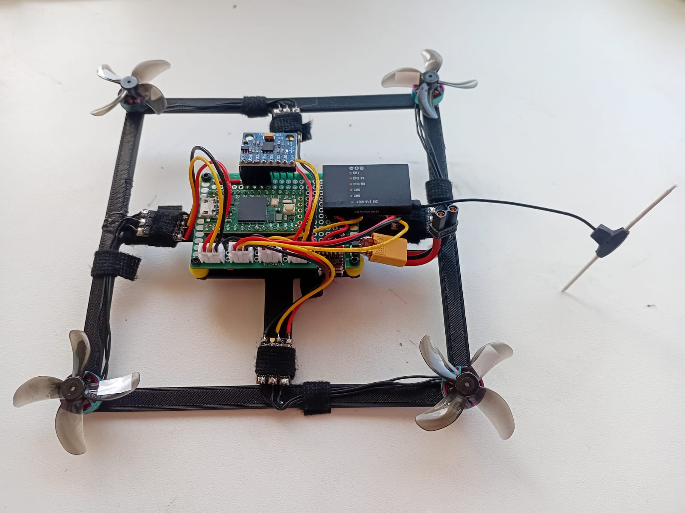

# Drone Project

This repository contains code and resources for a drone manual project.  
The code is based on:  
Carbon Aeronautics - Build and program your own Arduino drone  
https://www.youtube.com/watch?v=QvRxxjaLjxg&list=PLeuMA6tJBPKsAfRfFuGrEljpBow5hPVD4

## Videos
1. First take off in angle mode  
https://www.youtube.com/watch?v=qaAwmK13c40

## Frame
3d print stl  
https://www.thingiverse.com/thing:7125649

## Parts
1. MCU - Teensy 4.0  
https://www.aliexpress.com/item/1005006850272944.html

2. Gyro - MPU6050 GY-512  
https://www.aliexpress.com/item/1005007129504945.html

3. RC receiver - BetaFPV ELRS 2.4GHz 5Channel PWM output  
https://www.aliexpress.com/item/1005003988410245.html

4. ESC - DYS XSD 7A BLheli_s  
https://www.aliexpress.com/item/1005006819059568.html

5. Motor - Rcinpower gts v3 1003 22000kv  
https://www.aliexpress.com/item/1005006431510954.html

6. Propellor - GEFMAN 1609 4 blades  
https://www.aliexpress.com/item/1005008130136207.html

7. Battery - 2S  
https://www.aliexpress.com/item/1005007558403107.html

8. Remote Controller - Radio Master Pocket, ELRS 2.4GHz  
https://www.aliexpress.com/item/1005008011579904.html
